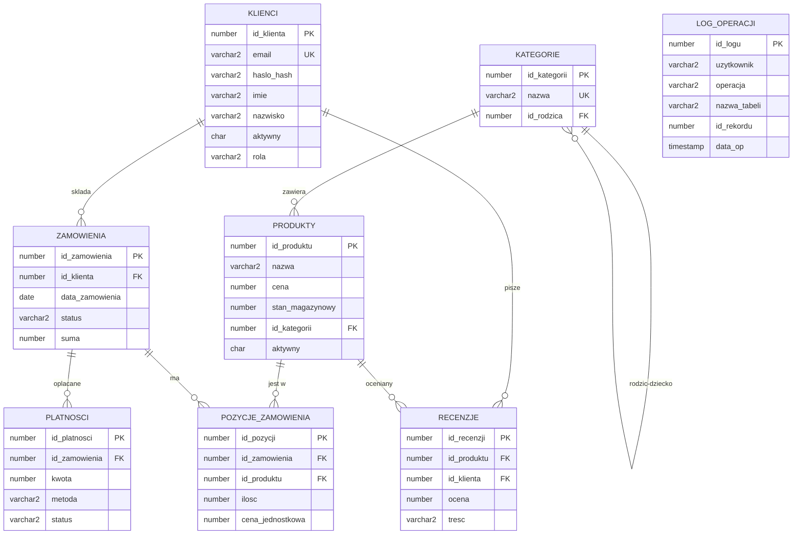

# Diagram zwiazkow encji (ERD)

Diagram w skladni Mermaid - renderuje sie w VS Code (z rozszerzeniem Mermaid),
na GitHubie oraz w wielu edytorach Markdown.

LOG_OPERACJI nie ma kluczy obcych - jest wypelniany przez triggery audytowe
i przechowuje historie operacji na pozostalych tabelach.
